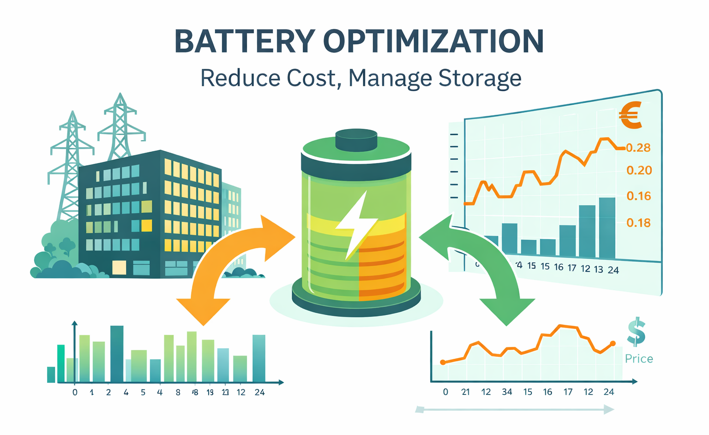
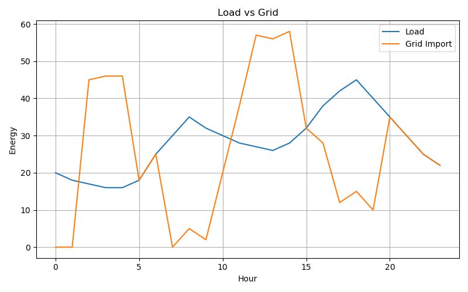
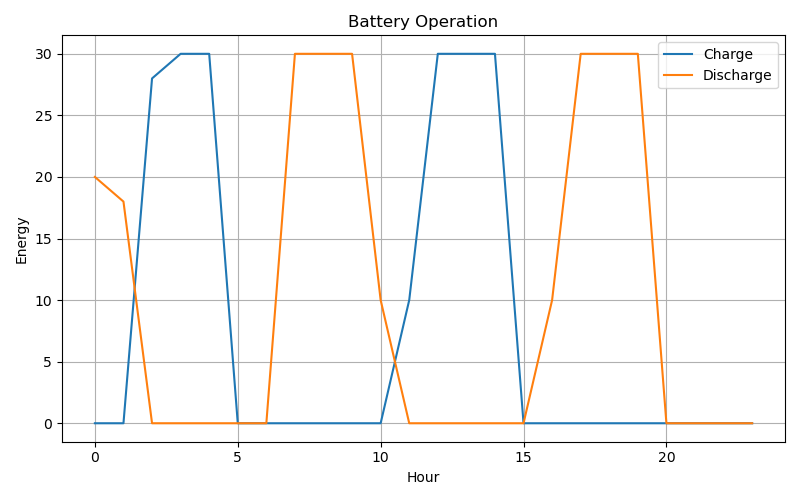
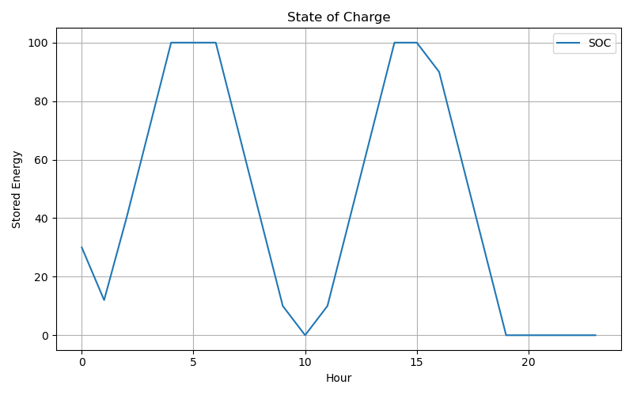
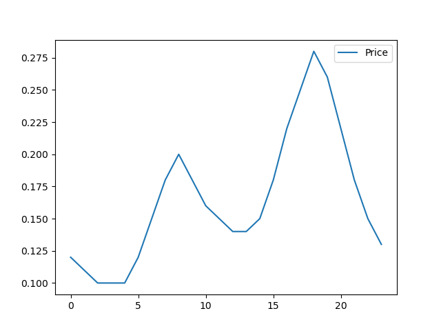

# Battery Optimization for Energy Cost Minimization

---

## Overview

This project implements a simple optimization model for energy management in a building with a battery.

The goal is to **minimize total electricity cost** over a 24-hour horizon by optimally scheduling:
- grid energy usage
- battery charging
- battery discharging

---

## Problem Setup

We consider:
- a building with fixed (non-flexible) demand
- hourly electricity prices
- a battery with capacity and power limits

At each hour, the system must satisfy demand while deciding how to use the battery efficiently.

---

## Optimization Model

### Objective

Minimize total cost:

minimize Σ (price[t] × grid[t])

---

### Constraints

- Energy balance:
  grid[t] + discharge[t] = load[t] + charge[t]

  
- Battery dynamics:
  E[t] = E[t-1] + charge[t] - discharge[t]

  
- Battery limits:
  - capacity bounds
  - charge/discharge limits

---

## Results

### Load vs Grid

---

### Battery Operation

---

### State of Charge (SOC)

---

### Electricity Price

---

## Key Insight

The model naturally learns to:

- charge the battery when prices are low  
- discharge when prices are high  

→ achieving cost reduction through energy shifting.

---

## Tech Stack

- Python
- PuLP (Linear Programming)
- Matplotlib

---

## Future Work

- Add PV generation
- Add EV / V2G integration
- Include battery efficiency
- Add real market data (e.g. DAM prices)
- Extend to multi-day optimization

---

## Author

Electrical & Computer Engineering student  
Focus: Energy Markets, Optimization, Intelligent Energy Systems

battery-optimization-energy-management/
│
├── battery_optimization_v1.ipynb
├── README.md
├── battery_optimization_v1_logo.png
└── plots/
    ├── load_vs_grid.png
    ├── battery_operation.png
    ├── soc.png
    └── price.png
